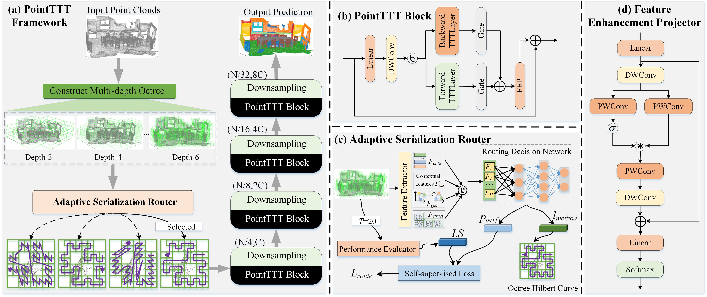

<div align="center">
<h1>PointTTT</h1>
<h3>Unlocking Test-Time Training  for 3D Point Clouds</h3>

# Overview

<div  align="center">    
 
</div>

<div align="left">

## Highlights

- Gating Bi-TTTLayer for bidirectional context modeling on serialized point clouds.
- Feature Enhancement Projector for local geometric and channel interaction modeling.
- Adaptive Serialization Router for selecting among Z-order, transposed Z-order, Hilbert, and transposed Hilbert serialization strategies.
- Experiments for ModelNet40 3D object classification (97.4% Accuracy) and ScanNet semantic segmentation (77.6% mIoU).

## 1. Environment
The code has been tested on Ubuntu 20.04 with 4 A40 GPUs (48GB memory).
1. Python 3.10.13
    ```bash
    conda create -n your_env_name python=3.10.13
    ```
2. Install torch 2.1.1 + cu118

    ```bash
    pip install torch==2.1.1 torchvision==0.16.1 torchaudio==2.1.1 --index-url https://download.pytorch.org/whl/cu118
    ```

3. Clone this repository and install the requirements.

    ```bash
    pip install -r requirements.txt
    ```
## 2. ModelNet40 Classification

1. **Data**: Run the following command to prepare the dataset.

    ```bash
    python tools/cls_modelnet.py
    ```

2. **Train**: Run the following command to train the network with 1 GPU. Checkpoints will be released later.
    ```bash
    python classification.py --config configs/cls_m40.yaml SOLVER.gpu 0,
    ```
3. **ModelNet40** few-shot splits:

- The few-shot setting follows Point-BERT. Please download the ModelNet few-shot split files from the Point-BERT dataset instructions: [Point-BERT DATASET.md](https://github.com/Julie-tang00/Point-BERT/blob/master/DATASET.md).
- After downloading the splits, organize them to match the paths used in `configs/cls_m40.yaml`, for example `data/ModelNet40/ModelNetFewshot/10way_20shot/6_train.txt` and `data/ModelNet40/ModelNetFewshot/10way_20shot/6_test.txt`.
## 3. ScanNet Segmentation
1. **Data**: Download the data from the
   [ScanNet benchmark](https://kaldir.vc.in.tum.de/scannet_benchmark/).
   Unzip the data and place it to the folder <scannet_folder>. Run the following
   command to prepare the dataset.

    ```bash
    python tools/seg_scannet.py --run process_scannet --path_in scannet
    ```
    The filelist should be like this:
    ```bash

    ├── scannet
    │ ├── scans
    │ │ ├── [scene_id]
    │ │ │ ├── [scene_id].aggregation.json
    │ │ │ ├── [scene_id].txt
    │ │ │ ├── [scene_id]_vh_clean.aggregation.json
    │ │ │ ├── [scene_id]_vh_clean.segs.json
    │ │ │ ├── [scene_id]_vh_clean_2.0.010000.segs.json
    │ │ │ ├── [scene_id]_vh_clean_2.labels.ply
    │ │ │ ├── [scene_id]_vh_clean_2.ply
    │ ├── scans_test
    │ │ ├── [scene_id]
    │ │ │ ├── [scene_id].aggregation.json
    │ │ │ ├── [scene_id].txt
    │ │ │ ├── [scene_id]_vh_clean.aggregation.json
    │ │ │ ├── [scene_id]_vh_clean.segs.json
    │ │ │ ├── [scene_id]_vh_clean_2.0.010000.segs.json
    │ │ │ ├── [scene_id]_vh_clean_2.ply
    │ ├── scannetv2-labels.combined.tsv
    ```

2. **Train**: Run the following command to train the network with 4 GPUs and port 10001. 

    ```bash
    python scripts/run_seg_scannet.py --gpu 0,1,2,3 --alias scannet --port 10001
    ```

3. **Evaluate**: Run the following command to get the per-point predictions for the validation dataset with a voting strategy. And after voting, the mIoU is 77.6 on the validation dataset. Checkpoints will be released later.

    ```bash
    python scripts/run_seg_scannet.py --gpu 0 --alias scannet --run validate
    ```

## Acknowledgement

PointTTT was developed from the octree-based point cloud learning pipeline used
by Point-Mamba and related OCNN/OctFormer tooling. 

We thank the authors of Point-Mamba, OCNN, OctFormer, and the original TTT
implementation for making their work available to the community.
