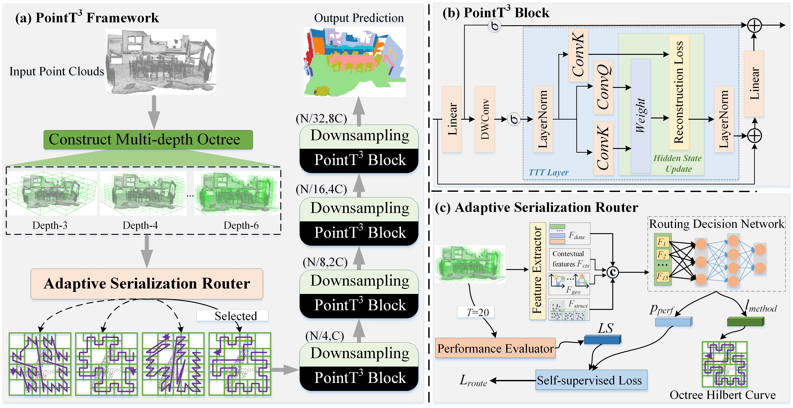

<div align="center">
<h1>PointTTT</h1>
<h3>Test-Time Training for 3D Point Cloud Modeling</h3>
</div>


# Overview

<div  align="center">    
 
</div>
### Paper-reported results

All PointTTT results in the paper use fully supervised training from scratch
without external pre-trained weights. Classification results are reported
without voting.

| Task | Dataset / protocol | Paper metric | PointTTT result |
| --- | --- | --- | ---: |
| Object classification | ScanObjectNN OBJ-BG | OA | 93.1% |
| Object classification | ScanObjectNN OBJ-ONLY | OA | 90.5% |
| Object classification | ScanObjectNN PB-T50-RS | OA | 84.5% |
| Object classification | ModelNet40 | OA | 97.4% |
| Object classification | ShapeNet55 | OA | 91.2% |
| Part segmentation | ShapeNetPart | class / instance mIoU | 84.2% / 87.1% |
| Semantic segmentation | ScanNet validation / test | mIoU | 77.6% / 77.3% |
| 3D object detection | SUN RGB-D | mAP@0.25 / mAP@0.50 | 68.5% / 50.1% |

For supervised few-shot classification on ModelNet40, PointTTT achieves
`97.0 ± 2.6`, `99.1 ± 0.6`, `93.8 ± 1.2`, and `97.3 ± 1.7` accuracy for 5-way
10-shot, 5-way 20-shot, 10-way 10-shot, and 10-way 20-shot, respectively. Each
setting is repeated 10 times, and the values are mean ± standard deviation.

## 1. Environment
The code has been tested on Ubuntu 20.04.

1. Python 3.10.13
    ```bash
    conda create -n your_env_name python=3.10.13
    ```

2. Install torch 2.1.1 + cu118

    ```bash
    pip install torch==2.1.1 torchvision==0.16.1 torchaudio==2.1.1 --index-url https://download.pytorch.org/whl/cu118
    ```

3. Clone this repository and install the requirements.

    ```bash
    pip install -r requirements.txt
    ```

## 2. ModelNet40 Classification

1. **Data**: Run the following command to prepare the dataset.

    ```bash
    python tools/cls_modelnet.py
    ```

2. **Train**: PointTTT uses the standard 9,843/2,468 train/test split and is
   trained for 300 epochs on two 24 GB RTX 3090 GPUs with a total batch size of 32.
   The checked-in `cls_m40.yaml` currently points to one few-shot split, so the
   standard file lists must be overridden for the paper's 97.4% OA result.

    ```bash
    python classification.py \
      --config configs/cls_m40.yaml \
      SOLVER.gpu 0,1, \
      SOLVER.lr 0.00005 \
      SOLVER.logdir logs/m40/standard \
      DATA.train.filelist data/ModelNet40/filelist/m40_train.txt \
      DATA.test.filelist data/ModelNet40/filelist/m40_test.txt \
      DATA.train.batch_size 16 \
      DATA.test.batch_size 16
    ```

   PointTTT achieves 97.4% OA without voting, with 2.2M trainable parameters and
   1.08 GFLOPs in the paper.

## 3. ScanObjectNN Classification

The ScanObjectNN loader reads the original HDF5 files directly and supports the
three fixed train/test protocols used by Point-BERT:

| Protocol | Config |
| --- | --- |
| OBJ_BG | `configs/cls_scanobjectnn_objbg.yaml` |
| OBJ_ONLY | `configs/cls_scanobjectnn_objonly.yaml` |
| PB_T50_RS | `configs/cls_scanobjectnn_pbt50rs.yaml` |

The PointTTT repository configs use all 2048 points by default and do not require
PointNet++ FPS. To match the paper's classification training setup, use two
GPUs and a total training batch size of 32:

```bash
python classification.py \
  --config configs/cls_scanobjectnn_pbt50rs.yaml \
  SOLVER.gpu 0,1, \
  SOLVER.lr 0.00005 \
  DATA.train.batch_size 16 \
  DATA.test.batch_size 16
```

PointTTT achieves 93.1%, 90.5%, and 84.5% OA on OBJ-BG, OBJ-ONLY, and
PB-T50-RS, respectively, without voting.

To use Point-BERT-style 1024-point sampling, override the sampling parameters
for both splits. The implementation uses CPU FPS and caches the FPS indices in
each data-loader worker, so it does not require the PointNet++ CUDA extension:

```bash
python classification.py \
  --config configs/cls_scanobjectnn_pbt50rs.yaml \
  SOLVER.gpu 0,1, \
  SOLVER.lr 0.00005 \
  DATA.train.num_points 1024 \
  DATA.train.sampling pointbert \
  DATA.train.batch_size 16 \
  DATA.test.num_points 1024 \
  DATA.test.sampling pointbert \
  DATA.test.batch_size 16
```

In `pointbert` mode, training performs FPS to 1200 candidate points followed by
random sampling to 1024 points, while testing directly performs FPS to 1024
points. The reported `test/accu` is overall classification accuracy, matching
the evaluation metric used by Point-BERT. ScanObjectNN contains XYZ only, so
these configs use `feature: P`, `channel: 3`, and a 15-class output head.

## 4. ShapeNet55 Classification

Despite its legacy filename, `configs/cls_shapenet55_pretrain.yaml` trains and
evaluates a 55-class PointTTT classifier on the official ShapeNet55 train/test
lists. The repository loader randomly samples 1024 points from each 8192-point
cloud and applies unit-sphere normalization.

PointTTT is trained from scratch for 300 epochs on two 24 GB RTX 3090 GPUs with
a total batch size of 32 in the paper:

```bash
python classification.py \
  --config configs/cls_shapenet55_pretrain.yaml \
  SOLVER.gpu 0,1, \
  SOLVER.lr 0.00005 \
  DATA.train.batch_size 16 \
  DATA.test.batch_size 16
```

PointTTT achieves 91.2% OA without voting, with 2.2M trainable parameters and
1.36 GFLOPs in the paper.

### Optional supervised transfer experiment (not used for paper results)

The best complete 55-class model is saved to:

```text
logs/shapenet55/supervised_1024/best_model.pth
```

The repository additionally allows this checkpoint to initialize ScanObjectNN
through `SOLVER.pretrained`. This is an optional extension: the paper explicitly
reports its PointTTT results as training from scratch without external
pre-trained weights. Only `model.backbone` is loaded; the incompatible 55-class
head is discarded and the ScanObjectNN 15-class head remains randomly
initialized. Use a new log directory so that an older fine-tuning checkpoint
is not resumed by mistake:

```bash
python classification.py \
  --config configs/cls_scanobjectnn_pbt50rs.yaml \
  SOLVER.gpu 0,1, \
  SOLVER.pretrained logs/shapenet55/supervised_1024/best_model.pth \
  SOLVER.logdir logs/scanobjectnn/pbt50rs_ft_shapenet55_1024
```

The same `SOLVER.pretrained` option works with the OBJ_BG and OBJ_ONLY configs.
An existing `*.solver.tar` in the target log directory takes priority and
resumes the interrupted ScanObjectNN fine-tuning run, including its optimizer
and scheduler state.

## 5. ShapeNetPart Segmentation From Scratch

The ShapeNetPart loader reads
`data/shapenet_part_seg_hdf5_data/hdf5_data` directly. The benchmark config
trains on the official train+validation split (14007 shapes), tests on 2874
shapes, and keeps all 2048 HDF5 points without CUDA FPS.

PointTTT is trained for 300 epochs on four NVIDIA A40 GPUs with a total batch
size of 32 in the paper. The checked-in per-GPU batch size of 8 matches that
setting:

```bash
python segmentation.py \
  --config configs/seg_shapenetpart.yaml \
  SOLVER.gpu 0,1,2,3,
```

The four-stage PointTTT segmentation backbone (internal class name
`PointMambaSeg_base`) uses channels `[96, 192, 384, 384]` and blocks
`[2, 2, 18, 2]`. Evaluation reports the ShapeNetPart metrics used in the paper:
instance-average `test/mIoUI`, class-average `test/mIoUC`, and all 16 category
IoUs. The checkpoint selected by `mIoUI` is saved to
`logs/shapenetpart/from_scratch_2048/best_model.pth`.

PointTTT achieves 84.2% class-average mIoU and 87.1% instance-average mIoU with
38.7M trainable parameters in Table 3 of the paper.

The repository also provides an additional ten-vote TTA evaluation after
training. This extra `final_tta_log.csv` result should not be presented as the
paper's Table 3 value unless it reproduces the values above. The TTA recipe is:
identity, identity with `RandomFlip(p=0.5)`, and scales 0.8, 0.85, 0.9, 0.95,
1.05, 1.1, 1.15, and 1.2. Softmax probabilities are summed before computing
`test/mIoUI` and `test/mIoUC`; the separate result is appended to
`logs/shapenetpart/from_scratch_2048/final_tta_log.csv`.

To run only this final TTA for an existing best checkpoint:

```bash
python segmentation.py \
  --config configs/seg_shapenetpart.yaml \
  SOLVER.run test_tta \
  SOLVER.gpu 0,1, \
  SOLVER.ckpt logs/shapenetpart/from_scratch_2048/best_model.pth \
  SOLVER.logdir logs/shapenetpart/from_scratch_2048/tta_eval
```

Set `SOLVER.final_test_best False` to disable the automatic post-training TTA.

## 6. ScanNet Segmentation

1. **Data**: Download the data from the
   [ScanNet benchmark](https://kaldir.vc.in.tum.de/scannet_benchmark/).
   Unzip the data and place it to the folder <scannet_folder>. Run the following
   command to prepare the dataset.

    ```bash
    python tools/seg_scannet.py --run process_scannet --path_in scannet
    ```
    The filelist should be like this:
    ```bash

    ├── scannet
    │ ├── scans
    │ │ ├── [scene_id]
    │ │ │ ├── [scene_id].aggregation.json
    │ │ │ ├── [scene_id].txt
    │ │ │ ├── [scene_id]_vh_clean.aggregation.json
    │ │ │ ├── [scene_id]_vh_clean.segs.json
    │ │ │ ├── [scene_id]_vh_clean_2.0.010000.segs.json
    │ │ │ ├── [scene_id]_vh_clean_2.labels.ply
    │ │ │ ├── [scene_id]_vh_clean_2.ply
    │ ├── scans_test
    │ │ ├── [scene_id]
    │ │ │ ├── [scene_id].aggregation.json
    │ │ │ ├── [scene_id].txt
    │ │ │ ├── [scene_id]_vh_clean.aggregation.json
    │ │ │ ├── [scene_id]_vh_clean.segs.json
    │ │ │ ├── [scene_id]_vh_clean_2.0.010000.segs.json
    │ │ │ ├── [scene_id]_vh_clean_2.ply
    │ ├── scannetv2-labels.combined.tsv
    ```

2. **Train**: PointTTT is trained for 800 epochs on four NVIDIA A40 GPUs with a
   total training batch size of 12 in the paper. With four processes, the checked-in
   optimizer configuration produces the paper's group-wise learning rates of
   `4e-4` outside the PointTTT blocks and `4e-5` inside them. Checkpoints and
   logs are written to `logs/scannet/from_scratch_1cm`.

    ```bash
    python segmentation.py \
      --config configs/seg_scannet.yaml \
      SOLVER.gpu 0,1,2,3, \
      DATA.train.batch_size 3 \
      DATA.test.batch_size 1
    ```

3. **Validate**: Reload the selected `best_model.pth`, run the repository's
   120-vote validation helper, generate per-point labels, and calculate mIoU.
   PointTTT achieves 77.6% validation mIoU and 77.3% official-test mIoU.

    ```bash
    python scripts/run_seg_scannet.py --run validate --gpu 0,1,2,3 --port 10001
    ```

## 7. SUN RGB-D Detection (PointTTT + FCAF3D)

PointTTT's SUN RGB-D implementation is an optional MMDetection3D entry and does
not add imports to the existing classification or segmentation programs.
PointTTT follows the paper's protocol: 10 classes, 100,000 XYZRGB points,
depth-12 octrees at 0.01 m, FCAF3D, an 18-epoch schedule, and evaluation at 3D
IoU 0.25 and 0.50. Within FCAF3D, PointTTT serves as the four-stage backbone with
channels `[96, 192, 384, 384]` and blocks `[2, 2, 18, 2]`.
It already contains the compiled OCNN,
MMCV and MinkowskiEngine operators; the compatible mmsegmentation version is:

```bash
python -m pip install mmsegmentation==0.29.1
```
Before training, validate all 10335 point files and the official split:

```bash
python tools/check_sunrgbd.py --full
```

Train and validate on two GPUs:

```bash
CUDA_VISIBLE_DEVICES=0,1 OMP_NUM_THREADS=8 \
torchrun --nproc_per_node=2 --master_port=29501 \
  detection.py configs/det_sunrgbd.py --launcher pytorch \
  --cfg-options runner.max_epochs=18

## 8. PartNetE Part Segmentation (Repository Extension)

PartNetE is not evaluated or reported in the PointTTT paper. This section
documents an additional repository experiment and its results should not be
attributed to the paper. The loader uses the Pointcept-preprocessed
`data/PartNetE/few_shot` and
`data/PartNetE/test` splits directly. It follows the Utonia protocol with 45
object categories, 148 category-specific part labels, 1 cm grid sampling,
CE+Lovasz loss, 800 epochs, and validation every 100 epochs. Train on two GPUs:

```bash
python segmentation.py \
  --config configs/seg_partnete.yaml \
  SOLVER.gpu 0,1,
```

The primary checkpoint metric is `test/mIoU_part`, computed over the 103 named
parts while excluding every category's `other` part. The best checkpoint is
saved to `logs/partnete/from_scratch_1cm/best_model.pth`. Training automatically
reloads it for the official ten-branch Utonia TTA. Run that final test alone:

```bash
python segmentation.py \
  --config configs/seg_partnete.yaml \
  SOLVER.run test_tta \
  SOLVER.gpu 0,1, \
  SOLVER.ckpt logs/partnete/from_scratch_1cm/best_model.pth \
  SOLVER.logdir logs/partnete/from_scratch_1cm/tta_eval
```

For an ordinary single-pass test, replace `SOLVER.run test_tta` with
`SOLVER.run test`. The latest epoch-boundary solver checkpoint is written to
`checkpoints/last.solver.tar` and is automatically used to resume an
interrupted run. The best validation checkpoint is saved separately as
`best_model.pth`.

## 9. Acknowledgement 
The PointTTT study acknowledges support from the Scientific Research Fund
Project of the Department of Education of Yunnan Province (Nos. KC-252512912
and 2026Y0184).
